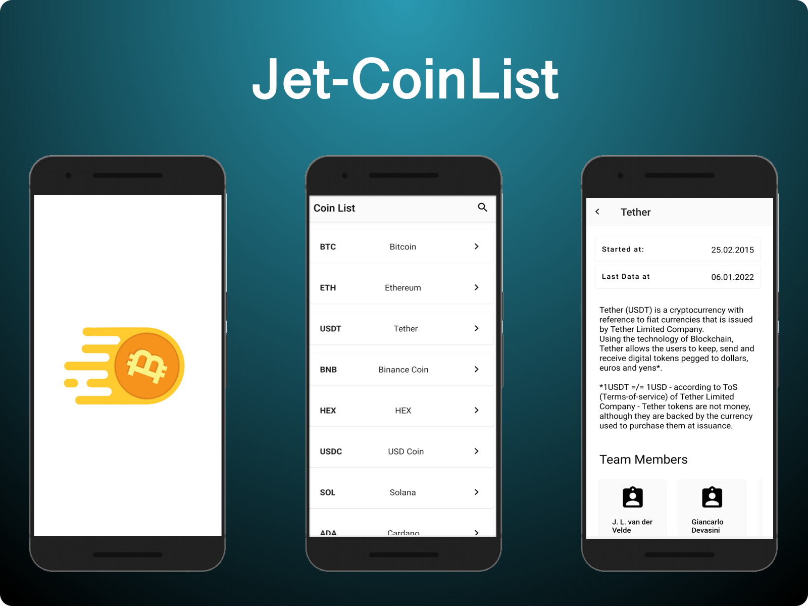

<h1 align="center">Jet-CoinList</h1>

<p align="center">
  <a href="https://opensource.org/licenses/Apache-2.0"></a>
</p>

<p align="center">  
CoinList is a simple app based on Jetpack Compose, modern tech-stack and Clean Architecture. The project is quite simple which shows the list of crypto currencies and their general info details gets from API.
</p>

 <p align="center">
  
</p>


## Tech stack
* ✅ Clean Architecture
* ✅ Repository pattern
* ✅ MVVM
* ✅ Jetpack Compose 
* ✅ Dagger - Hilt
* ✅ Livedata
* ✅ Viewmodel
* ✅ Retrofit
* ✅ Flow
* ✅ Kotlin Coroutines
* ✅ Material Components
* ✅ Jetpack Navigation Component Compose
* ✅ Light and Dark theme
* 🟩 Unit test (incoming)


## MAD Score


# License
```xml
Designed and developed by 2021 Yıldırım Tam

Licensed under the Apache License, Version 2.0 (the "License");
you may not use this file except in compliance with the License.
You may obtain a copy of the License at

   http://www.apache.org/licenses/LICENSE-2.0

Unless required by applicable law or agreed to in writing, software
distributed under the License is distributed on an "AS IS" BASIS,
WITHOUT WARRANTIES OR CONDITIONS OF ANY KIND, either express or implied.
See the License for the specific language governing permissions and
limitations under the License.
```

